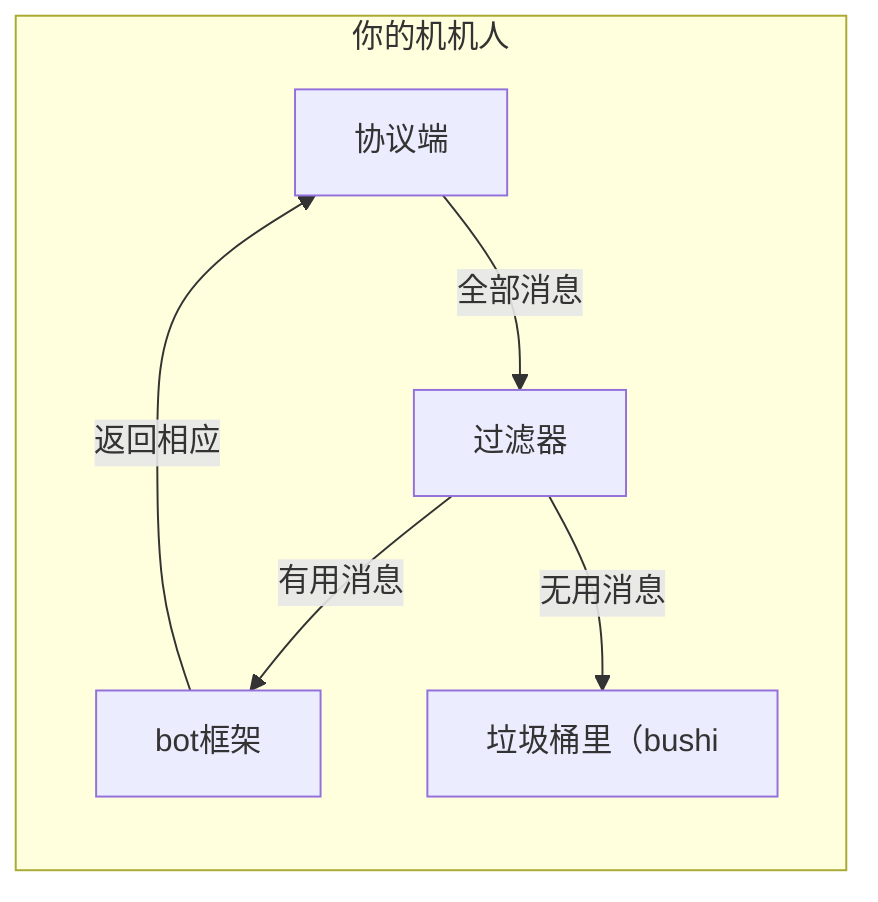
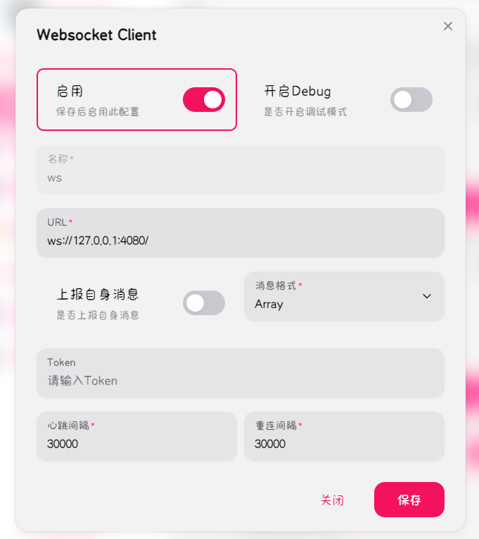
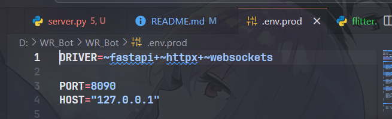
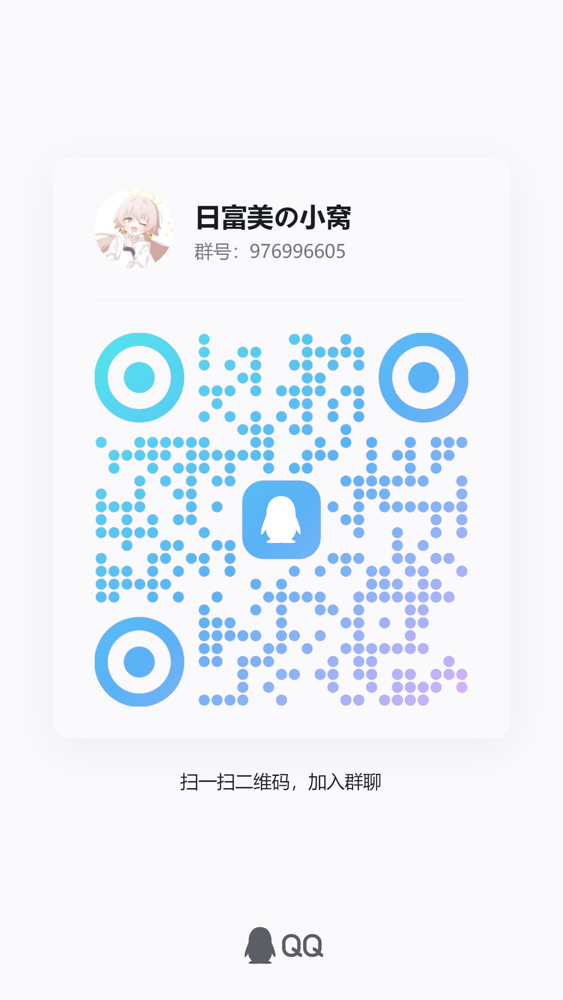

# SimpleBotMessageFilter
一个简易的，适用于onebotv11协议的，提供给bot的，消息过滤器

## 简介
在协议端和框架之间提供一个过滤器

将协议端的消息进行过滤，过滤掉不会触发指令的消息，避免bot因接收到无用信息而产生负担。

## 原理图

## 特点
- 暂行：针对一些需要多次接收消息的指令，例如问答等，提供了缓存暂行机制

## 使用
### 安装
```
git clone https://github.com/captain-wangrun-cn/SimpleBotMessageFilter
```
### 配置
新建一个配置文件`config.json`
示例：
```json
{
    "rules": [
        {
            "keyword": "/", 
            "rule": "contains", 
            "bypass": {
                "enable": true, 
                "data": [
                    {
                        "keyword": "扔漂流瓶",
                        "rule": "contains",
                        "duration": 30
                    },{
                        "keyword": "每日问答",
                        "rule": "contains",
                        "duration": 30
                    }
                ]
            }
        },

        {
            "keyword": "今日老婆", 
            "rule": "contains"
        }
    ]
}
```
配置讲解：
这个配置文件，将会告诉过滤器

当消息内容包含`/`时，将会通过；
并且，如果消息内容包含`扔漂流瓶`或`每日问答`，则会暂行30秒；
在这段时间内，所有由同一个`user_id`发送的消息都会直接通过

> [!IMPORTANT]
> 什么是`暂行`？
>
> 字面意思来说，“暂时放行”。
> 当同时符合主规则与暂行条件时，将会缓存这个user_id
> 在缓存时间内，所有由同一个`user_id`发送的消息都会直接通过
>
> 此机制是为了解决一些需要多次接收消息的指令，例如问答等

- `rules`：消息过滤规则列表，每个规则包含三个字段：
  - `keyword`：触发指令的关键词
  - `rule`：匹配规则，目前支持`contains`（包含）、`not_contains`（不包含）、`starts_with`（以...开头）、`ends_with`（以...结尾）、`equals`（等于）、`not_equals`（不等于）
  - `bypass`：暂行规则`（可选）`
    - `enable`：是否开启暂行
    - `data`：暂行规则列表，每个规则包含三个字段：
      - `keyword`：触发暂行的关键词
      - `rule`：匹配规则（与`rules`中的规则相同）
      - `duration`：暂行持续时间（单位：秒）

## 运行
```
python src/main.py -H 127.0.0.1 -p 4080 -c path/to/your/config.json -u ws://localhost:8090/onebot/v11/ws -i 1611249573
```
- `-H`：过滤器监听的IP地址
- `-p`：过滤器监听的端口,默认`4080`
- `-c`：配置文件路径
- `-u`：bot框架的WebSocket地址
- `-i`：bot框架的机器人id（通常为机器人QQ号）
- `-d`：调试模式，打印更多信息，可选（不建议开启，因为开发的时候太懒了，留了一大堆debug...）

## 配置连接
此过滤器采用`反向WebSocket`，所以需要协议端主动连接到过滤器，过滤器再连接到bot框架。

### 示例连接配置
协议端（napcat）



bot框架（nonebot）



过滤器
```
python main.py -H 127.0.0.1 -p 4080 -c D:\\360MoveData\\Users\\18889\\Documents\\SimpleBotMessageFilter\\config\\config.json -u ws://localhost:8090/onebot/v11/ws -i 1611249573
```

## 寄语
希望这个项目能帮助到你！
虽然但是！本项目写的非常非常的史，欢迎提出issue或者PR！

欢迎入群聊聊天~

